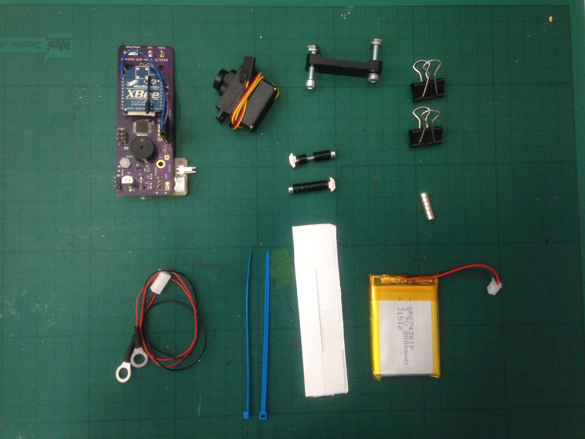

# Gondola fix

## tools required

* 2.5mm hex
* 3mm hex
* small cross head screwdriver
* 8mm spanner
* ladder

## work required

### install servo

* cam angle will need adjusting before fitting
* use cable tie to shorten excess cable

### install battery

* use sticky pads to hold in place, check PCB position first

### install pcb

* use 1 spacer above and 2 below at one end, and 1 above and 3 below for the other
* plug in battery (polarised plug)
* plug in servo (non polarised plug so note polarity on pcb - black is 0v)

### install charger cable

* check polarity of charger hangers before attaching wires to the bolts
* plug in charger cable (polarised plug)

### adjust pen set tool

* after servo change will need to adjust pen test

### conductive grease

* top up conductive grease on charging hangers

# String untangle

## tools required

* 5mm hex key for bolts

## work required

* untangle string
* check homing works correctly

