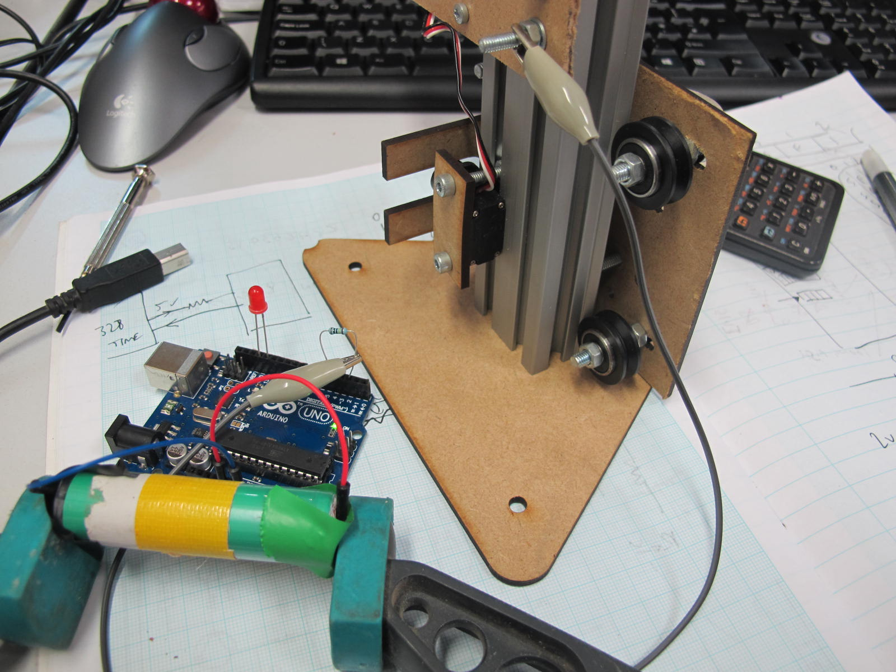

# capacitive touch on the gondola

If people lift the gondola the strings can unwind or get tangled

We're planning on using PTFE tube for the string to run through at the top corners, which will stop the lack of tension getting through to the spools.

However if the gondola is lifted if the spools are unwinding the string could get tangled up.

So this test is to see if the gondola can sense when it's touched, and send a signal to linuxcnc to pause the drawing.

We were worried that without a ground connection the capacitive touch method wouldn't work, but it seems to work fine.

# method

[video](https://www.youtube.com/watch?v=7M-Ta0E2XPM&feature=youtu.be)

a 1M resistor is connected between 2 pins. One of the pins is also connected to the aluminium of the gondola.

# test code

[cap.ino](cap.ino)

using this [capacitive touch library](https://github.com/PaulStoffregen/CapacitiveSensor)
