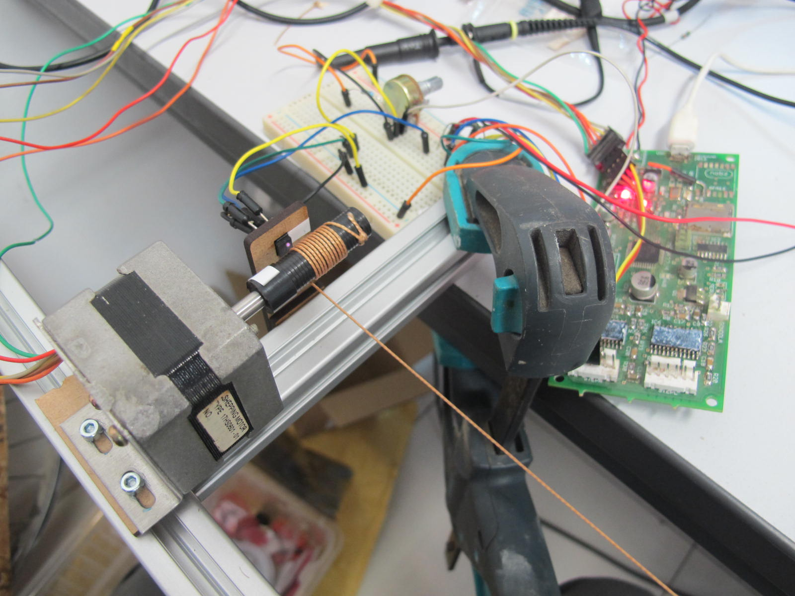
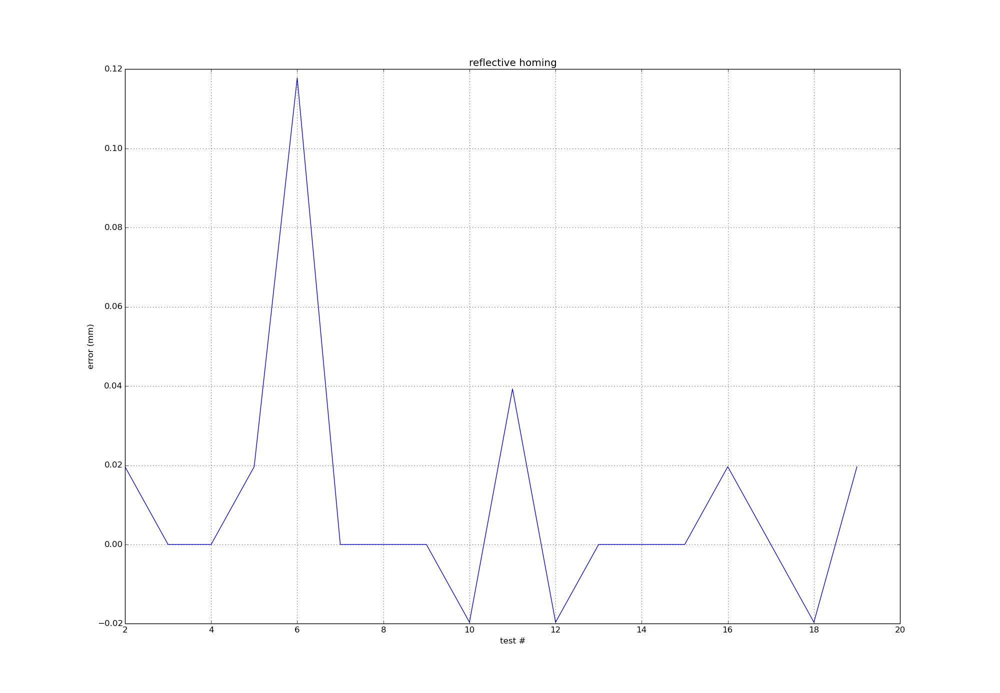

# Testing reflective homing

This method of homing is interesting to explore because it means our home point can be in the middle of the robot's range rather than at the edges. The edges are harder to get to because if the motors aren't co-ordinated (like at power on) there can be too much tension in the strings.

It's also interesting because if we can sense the string on the spool we have a 1 bit absolute position sensor. This means even if this method can't provide precision homing, it will help move the motors to a safe starting place before a more traditional homing method is used.

* 1600 count encoder with thread wrapped twice
* 8 time microstepping
* 12v
* 0.2A
* 130g weight
* using [OPB608A](http://uk.rs-online.com/web/p/photoelectric-sensors/1944018/?searchTerm=194+4018&relevancy-data=636F3D3126696E3D4931384E525353746F636B4E756D6265724D504E266C753D656E266D6D3D6D61746368616C6C26706D3D5E5C647B337D5B5C732D2F255C2E2C5D5C647B332C347D2426706F3D313426736E3D592673743D52535F53544F434B5F4E554D4245522677633D4E4F4E45267573743D3139342034303138267374613D3139343430313826)
* spool is black nylon with a 1mm thread, string is generic brown braid, about 0.8mm

## Results

Test shows the homing is accurate to within +- 0.25mm. However, the results are susceptible to changes in ambient light.

