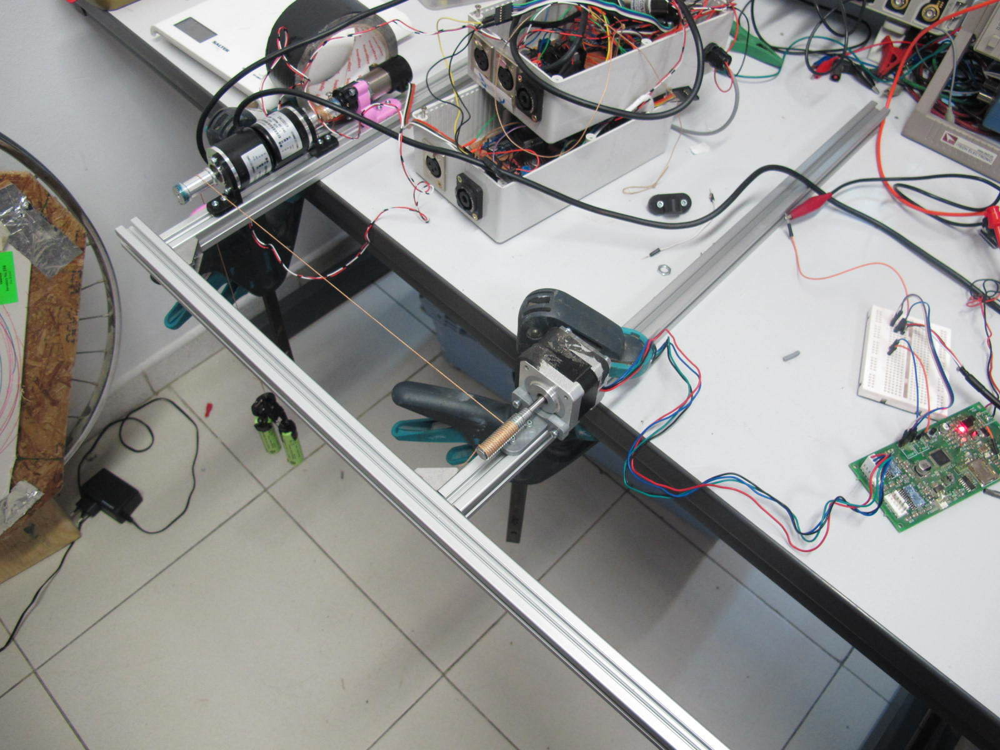

# Testing screw thread uniformity

* standard M10 threaded bar mounted to NEMA17 200 steps per rev stepper
* 8 time microstepping
* 12v
* 0.2A
* 130g weight

[Test program](test.py) sends steps for 10 revolutions, recording encoder position at each 20 step interval.

[firmware](screwthread-uniformity.ino) is running on Arduino.

# Results

Graphs generated by [plot.py](plot.py)

* Green line is 1 to 1 stepper to encoder (perfect linearity)
* Blue line is measured stepper vs encoder

## 300 mm

Graph shows excellent linearity between steps and string length
