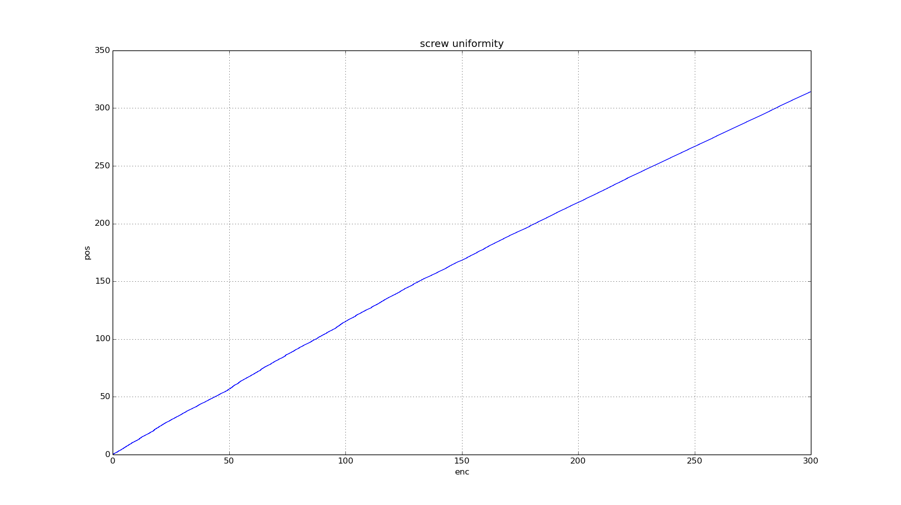

# Testing screw thread uniformity

* standard M10 threaded bar mounted to NEMA17 200 steps per rev stepper
* 8 time microstepping
* 12v
* 0.2A
* 130g weight

20k times 20 steps, recording encoder position at each 20 step interval

should be 311, is 339 so over 300mm there is a 30mm error!
