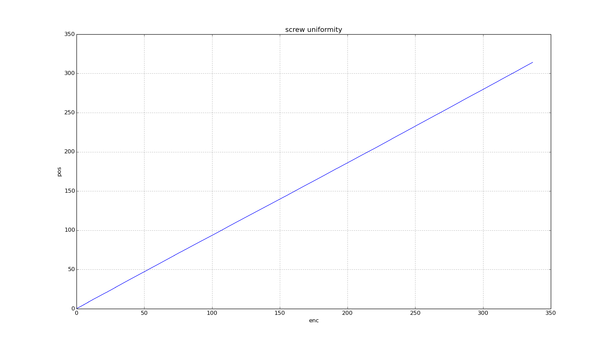
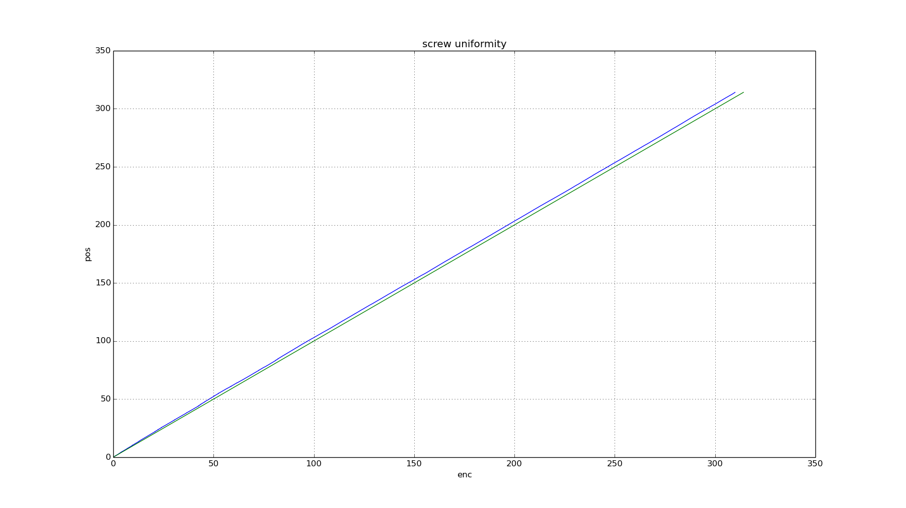
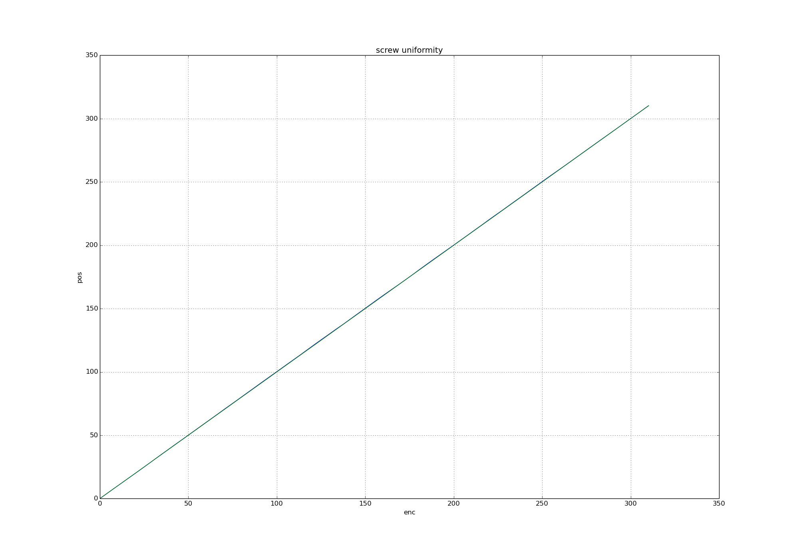

# Testing screw thread uniformity

* standard M10 threaded bar mounted to NEMA17 200 steps per rev stepper
* 8 time microstepping
* 12v
* 0.2A
* 130g weight

[Test program](test.py) sends 20 steps 20k, recording encoder position at each 20 step interval.

Not sure if this is actually happening because with 400k steps at 3200 steps per
rev = 125 revolutions, and it was maximum 10 revs.

# Results

Graphs generated by [plot.py](plot.py)

* Green line is 1 to 1 stepper to encoder (perfect linearity)
* Blue line is measured stepper vs encoder

## 1200 mm

## 600 mm

## 300 mm

300mm graph shows error of 16mm over 300mm string wind. Why?
Length of studding on stepper is about 30mm. Therefore distance between
hypotenuse and adjacent is about 1.5mm. So error is about 10 times more than I
expect.
