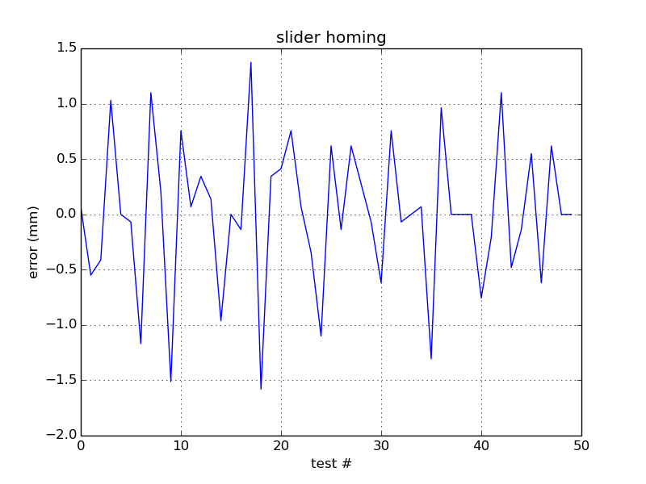
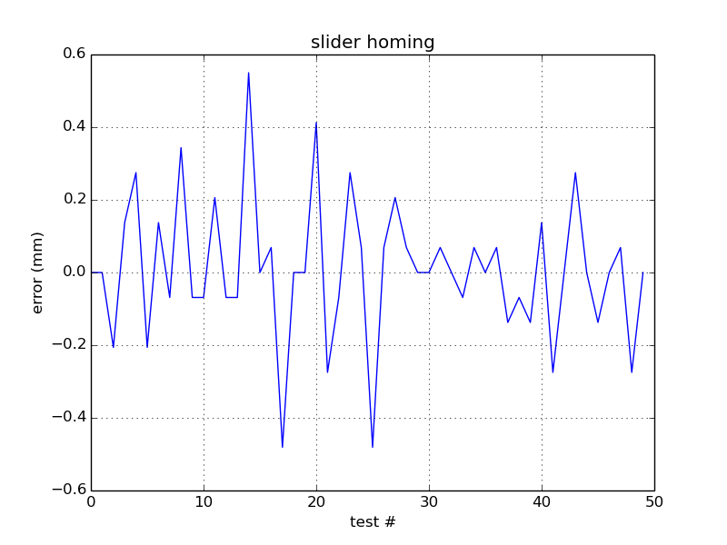
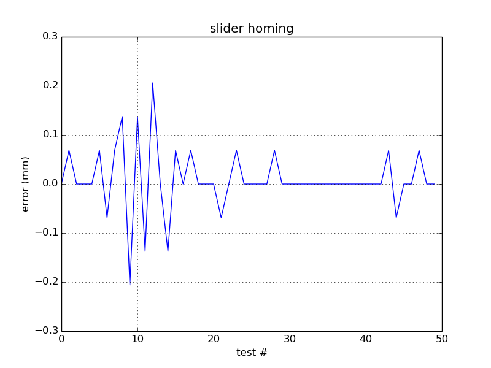

# Testing sliding homing

Same as the reflecto homing but using a slider on a screwthread. Position is
picked up with an opto. Slider is long enough to give 1 bit absolute positioning. 

Results show better than opto homing (0.12mm max error on a 19mm spool), and
much more reliable.

## Setup

* 8 time microstepping
* 12v
* 0.2A
* m6 threaded bar, rexroth extrusion for rail
* direct drive stepper
* 10k R on opto collector [Optek OPB815L](http://uk.rs-online.com/web/p/slotted-optical-switches/1944024/)
* 35mm diameter spool

## Results

All plots show errors in mm calculated for a 35mm diameter spool.

* 2000 steps and with a short backoff. 

[data](error-2000step.pkl) 

* tufnol slider, pressfit nut, 4000 step

[data](error-slider.pkl)

The slider was doing some wobbling, tried with a spring but made it worse.

* 3d printed slider with 2 press fit nuts

[data](error-3dprinted.pkl)

