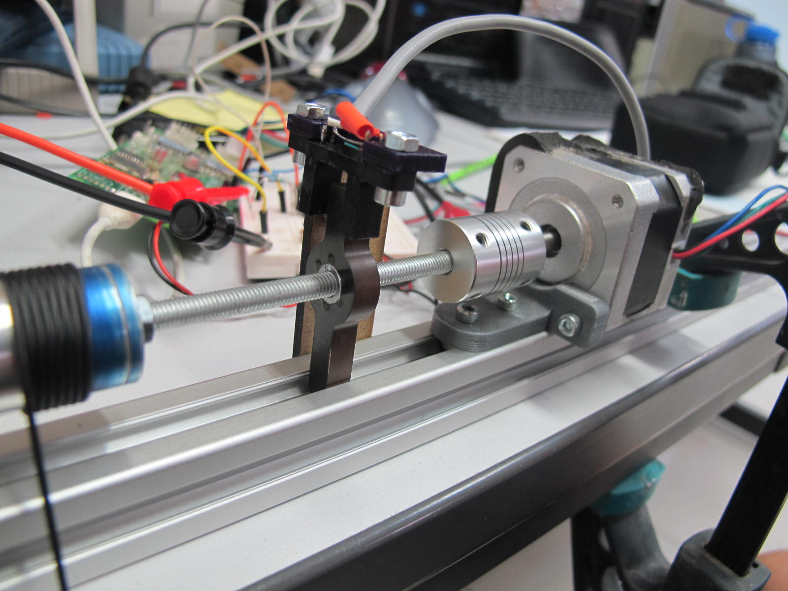

# Testing sliding homing

The [reflective homing
method](https://github.com/mattvenn/atbristol-megadrawbz/tree/master/tests/reflecto-homing) had some good benefits, but suffered from unreliability
with changing light conditions. In particular we wanted to keep the absolute
positioning to aid with homing. Ideally we want the method to be good enough for
homing (better than 0.3mm error).

For this test we coupled the spool with a screwthread and used the thread to
drive a slider that interrupted the photo interrupter.

Results show better than opto homing (0.12mm max error on a 19mm spool), and
much more reliable. With a bit more tuning we should get even lower errors, but
our calculations show that 0.3mm error is acceptable.

## Setup

[Video here](https://www.youtube.com/watch?v=r71VegIOap8&feature=youtu.be)

* 8 time microstepping
* 12v
* 0.2A
* m6 threaded bar, rexroth extrusion for rail
* direct drive stepper
* 10k R on opto collector [Optek OPB815L](http://uk.rs-online.com/web/p/slotted-optical-switches/1944024/)
* 35mm diameter spool

## Results

All plots show errors in mm calculated for a 35mm diameter spool.

* 2000 steps and with a short backoff. 

[data](error-2000step.pkl) 

* tufnol slider, pressfit nut, 4000 step

[data](error-slider.pkl)

The slider was doing some wobbling, tried with a spring but made it worse.

* 3d printed slider with 2 press fit nuts

[data](error-3dprinted.pkl)

